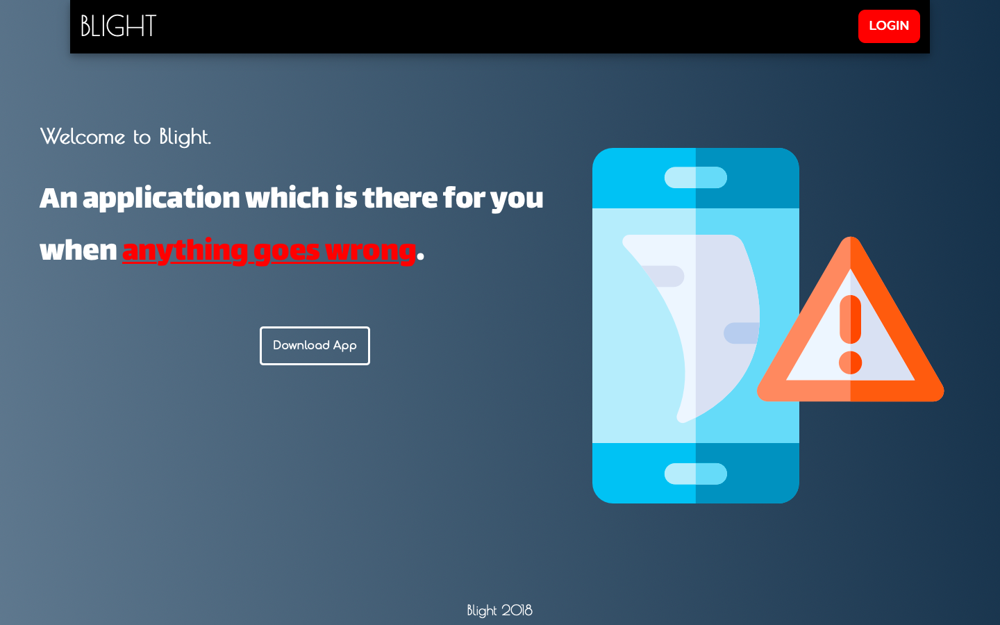
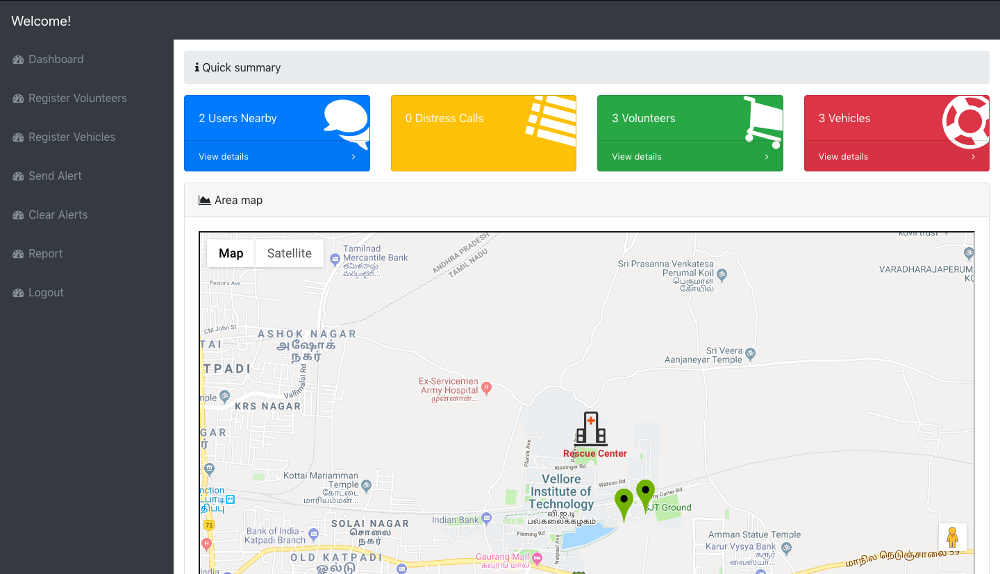
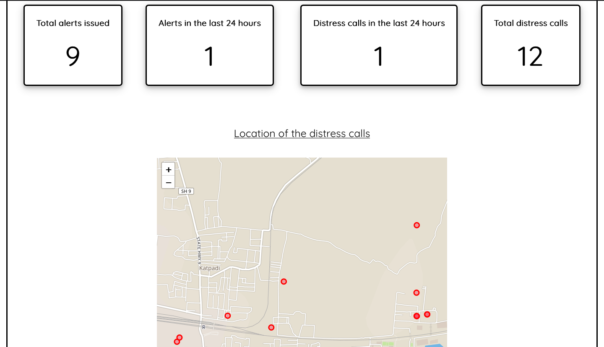
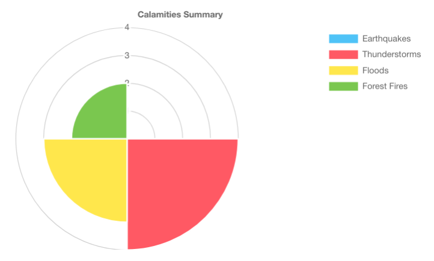
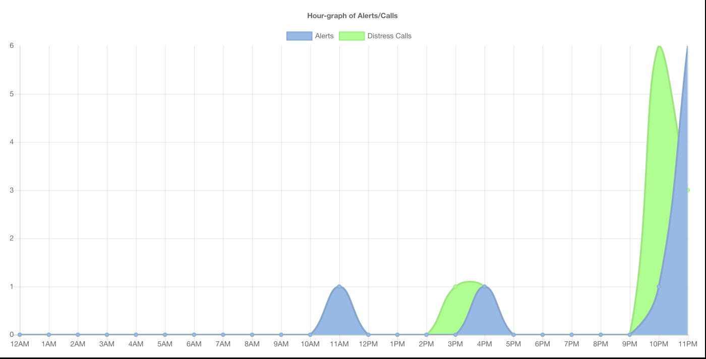

# Blight-Website
This is the website module for the project - Blight. 

# Blight
The main motive of this project is to provide a live feed of the victim to relevant authorities to allow the victim to get out of danger asap. In addition, this project provides the user with an alert in case of any calamities.

# Screenshots

</img>     
</img>    
</img>    
</img>    
</img>
